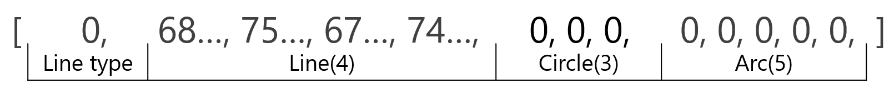

# drawing-generator

学習用の図面画像を作成します.　python3.10以降での環境で動作します．

## インストール方法

 1. Python3.10以降の仮想環境を用意する．
 1. AnacondaかPillowをインストールする．

## 使用ライブラリ，環境

* Python 3.10 <=
* Pillow

## 構成クラス

エンティティタイプや線種を追加する場合は以下のクラスを継承して作成してください．

### ParamGenerator

* 各エンティティの図形情報を生成する．

### Param2Img

* 生成した図形情報から任意サイズの画像を作成する．

## データ形式

システム上で生成，入力される図形情報は以下のパラメータを含むことを想定しています．

| Line type | Line | Circle | Arc |
| :---: | :---: | :---: | :---: |
| 線種 | Start X | Center X | Center X |
|      | Start Y | Center Y | Center Y |
|      | End X   | Radius   | Radius |
|      | End Y   |          | Start angle |
|      |         |          | End angle |

* エンティティひとつ分のパラメータ例

