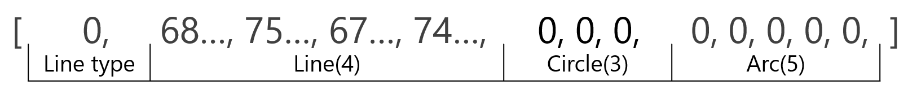

# drawing-generator

学習用の図面画像を作成します.　python3.10以降での環境で動作します．

## インストール方法

 1. Python3.10以降の仮想環境を用意する．
 1. AnacondaかPillowをインストールする．

## 使用ライブラリ，環境

* Python 3.10 <=
* Pillow

## 構成クラス

エンティティタイプや線種を追加する場合は以下のクラスを継承して作成してください．

### ParamGenerator

* 各エンティティの図形情報を生成する．

### Param2Img

* 生成した図形情報から任意サイズの画像を作成する．

## データ形式

システム上で生成，入力される図形情報は以下のパラメータを含むことを想定しています．

| Line type | Line | Circle | Arc |
| :---: | :---: | :---: | :---: |
| 線種 | Start X | Center X | Center X |
|      | Start Y | Center Y | Center Y |
|      | End X   | Radius   | Radius |
|      | End Y   |          | Start angle |
|      |         |          | End angle |

* エンティティひとつ分のパラメータ例



## CLI（main.py）での生成方法

`main.py` からコマンドラインで **line / circle / arc** のデータ生成（CSV + 画像出力）ができます． 

### 実行例

```bash
# line を生成（デフォルト設定）
python main.py --type line

# arc を生成（画像サイズ/図面サイズを指定）
python main.py --type arc --img_size 224 224 --drawing_size 400 280

# circle を生成（出力先ディレクトリとデータセット名を指定）
python main.py --type circle --out_dir ./EntityImages --name circle_test_v1

# 生成数を増やす
python main.py --type line --num 5000
```

### 引数一覧
- ```--type```（必須）: line / arc / circle を指定 
- ```--num```: 生成するエンティティ数（デフォルト: 1000） 
- ```--img_size WIDTH HEIGHT```: 出力画像サイズ（デフォルト: 224 224） 
- ```--drawing_size WIDTH HEIGHT```: 図面座標系のサイズ（デフォルト: 400 400） 
- ```--out_dir```: 出力ベースディレクトリ（デフォルト: EntityImages） 
- ```--name```: 出力データセット名（省略時: {type}_{img_w}x{img_h}）

### 出力内容とディレクトリ構成
実行すると、```--out_dir``` 配下に ```--name```（または自動生成名）のディレクトリが作られ、以下が出力されます：
- 生成した図形パラメータのCSV（{name}.csv）
- 画像ファイル群

例：```python main.py --type arc --out_dir ./dataset --name arc__test```
```
dataset/
└─ arc_test/
   ├─ arc_test.csv
   ├─ 000000.png
   ├─ 000001.png
   └─ ...
```


## 図面サイズ（drawing_size）と画像サイズ（img_size）の比率に関する注意点
このツールでは、
- drawing_size → 図面座標系（生成される図形の座標空間）
- img_size → 最終的な画像ピクセルサイズ

をそれぞれ独立に指定できます。したがって、以下のようなアスペクト比が異なる場合
```
drawing_size = (400, 280)
img_size = (224, 224)
```

この場合：
- 図面は横長（400:280）
- 出力画像は正方形（1:1）

となり、スケーリング時に
- 横方向と縦方向で縮尺が異なる
- 図形が歪む（円が楕円になる）

となってしまう。したがって画像生成時には以下のように指定することを推奨する。
```
drawing_width / drawing_height = img_width / img_height
```